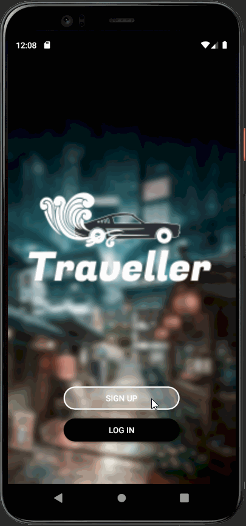
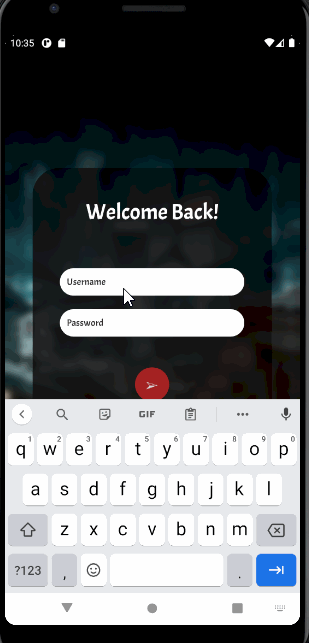
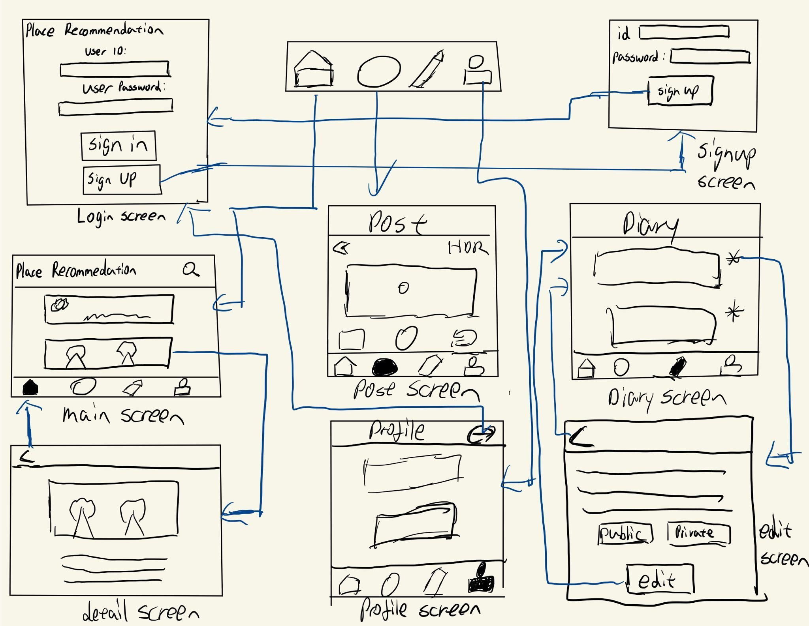
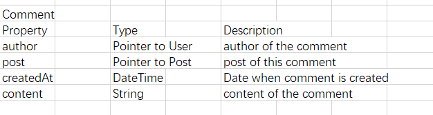
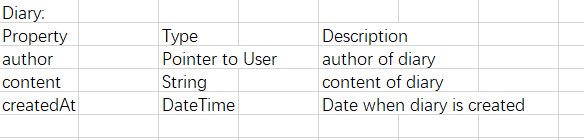
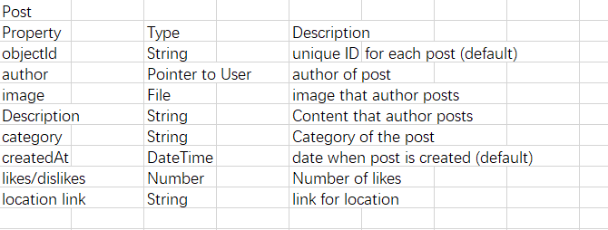
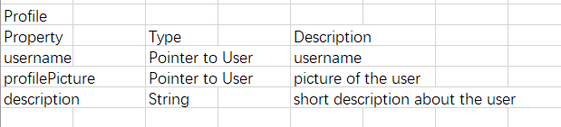
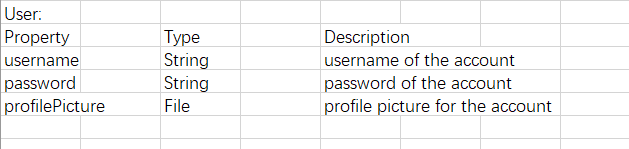

# Place Recommendation App

## Table of Contents
1. [Overview](#Overview)
1. [Product Spec](#Product-Spec)
1. [Wireframes](#Wireframes)
2. [Schema](#Schema)

## Overview
### Description
In this app, users can view different posts made by other users. These posts include description and images for the places that they recommended.

### App Evaluation
- **Category:** Social / photo 
- **Mobile:** Photo album 
- **Story:** This app will provide recommendations for people who like to travel.
- **Market:** Many people love to travel and share what their feeling and experience with that place.  
- **Habit:** For these who didd't travel, the user can look at the app everyday to see if some place that it is interest to them. For these who is traveling, it is fun for them to share their picture to another user. 
- **Scope:** First, the user can sign up and login to the app to share their picture about a place that they recommendate. Next, the user can interact with another people's post.

## Product Spec

### 1. User Stories (Required and Optional)

**Required Must-have Stories**

- [x] Users can sign up for an account.
- [x] Users can login/log out of their account.
- [x] Users can view the recommendations from different users
- [ ] Users can tap on the picture to display the descriptions and zoom the image.
- [x] Users can add a recommendation, including images,descriptions and the tag.
- [ ] Users can filter the recommendations based on the tag that each recommendation have.
- [x] Users can view their profile and see the posts that they made
- [ ] Users can type in keywords on the search bar to filter the recommendations
- [ ] Users are able to write a diary.
- [x] Users can choose between different tabs including post,write a diary, search, and profile.
- [ ] User can pull to refresh.
- [ ] Users can comment under other people's posts
- [ ] Users can view other people's comment
- [x] Posts are sorted

**Optional Nice-to-have Stories**

- [ ] Users can report innappropriate posts
- [ ] Users can upvote and downvote recommendations
- [ ] Users can have a freindlist.
- [ ] Users are able to add a new friend
- [ ] Users are able to message their friends

## Video Walkthrough

Here's a walkthrough of implemented user stories:
 
<b>Week 1</b>

 
<b>Week 2</b>

### 2. Screen Archetypes

* Login Screen
   * Users can login/log out of their account
   
* Signup Screen
   * Users can sign up for an account

* Posts Screen
   * Users add a recommendation, including images,descriptions and the tag

* Diary Screen
    * Users can write their diary.
    
* Detail Screen
    * Users can view the details of the recommandations.
* Profile Screen
    * Users can visit their profile and all the recommendations that they posted. They can also choose to logout by pressing the logout button
*  Main Screen
    *  Users can view recommandated places and the information about the user who posted this post.

### 3. Navigation

**Tab Navigation** (Tab to Screen)

* Main
* Post
* Profile
* Diary

**Flow Navigation** (Screen to Screen)

* Login Screen
   * Main Screen
   * SignUp Screen
* SignUp Screen
   * Login/SignUp Screen
* Main Screen
   * Tab Navigation
* Profile Screen
   * Post Screen
   * Login Screen
* Post Screen
   * Camera

## Wireframes
[Add picture of your hand sketched wireframes in this section]

### [BONUS] Digital Wireframes & Mockups

### [BONUS] Interactive Prototype

## Schema 
[This section will be completed in Unit 9]
### Models

### Networking
* Profile Screen
   * （Read/GET) Query all the columns inside Profile model with the logged in username
   * (Update/PUT) update user's information
   * (Delete) delete posts that are posted by this user.
* Home Screen
    * (Read/GET) Query all the columns inside the Post model
    * (Create/POST) Create a new post
    * (Update/PUT) user can choose to like or dislike a specific post
    * (Create/POST) user can comment under a post
* Diary Screen
    * (Read/GET) Qury all the columns inside the diary model
    * (Create/POST) user can add a new diary.
    * (Delete) user can choose to delete a diary 
- [Create basic snippets for each Parse network request]
- [OPTIONAL: List endpoints if using existing API such as Yelp]
